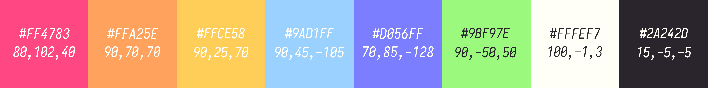
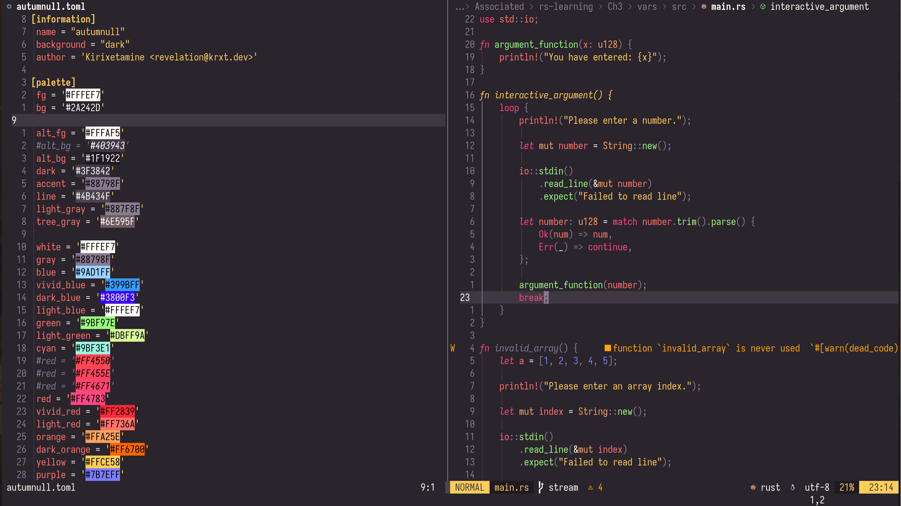
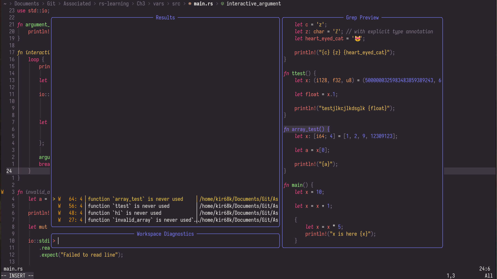

<h1 align="center">Stylism :: <i>Autumnull</i></h1>

<i>~ A dark flat theme for Neovim ~</i>

## Main palette

<i>The last values are CIELAB, NOT RGB</i>

## Description
Autumnull is yet another dark palette and colorscheme, to be used with Neovim.  
The theme has been created using L\*a\*b\* values, with help of [Adobe Color](https://color.adobe.com/), and [CIELab.io](https://cielab.io/).  
Generating a theme for Neovim in Lua has been done using [colorgen-nvim](https://github.com/LunarVim/colorgen-nvim), which I can heavily recommend.  
A TOML file is provided with color definitions, for use with colorgen-nvim.

## Plugin support?
The theme currently supports these plugins:
- [indent-blankline.nvim](https://github.com/lukas-reineke/indent-blankline.nvim/)
- [nvim-cmp](https://github.com/hrsh7th/nvim-cmp/)
- [lualine](https://github.com/nvim-lualine/lualine.nvim/)
- [Treesitter](https://github.com/nvim-treesitter/nvim-treesitter/)
- [Telescope](https://github.com/nvim-telescope/telescope.nvim/)

<i>More will be added going forward</i>

## Inspiration & Name
This theme was largely inspired by the [Monokai Pro](https://monokai.pro/vscode/) theme, my current wallpaper and love for the Autumn season, hence the "autumn" in the name.  
"-null" is a reference to `/dev/null`, or a null pointer, which I thought fit well.  
Writing the name capitalized is alright, I simply prefer plugin names to be all lowercase, or camelCase.

## Other programs
Since a commit on August 17th, this repository has become partly a meta repository. What this means is that while the core Neovim theme is still in the root directory (for simple use with plugin managers), palettes for other programs are present too.
The "others" directory inside this repository contains subdirectories for different programs, to which the theme has been ported.
Currently, it contains directories for:
- [Inkscape](https://inkscape.org/)1
- [GIMP](https://gimp.org/)1
- [Gradience](https://github.com/GradienceTeam/Gradience/)

1 — GIMP and Inkscape use the same format for palettes. A directory for both is created to minimize confusion, nonetheless.

## Previews

