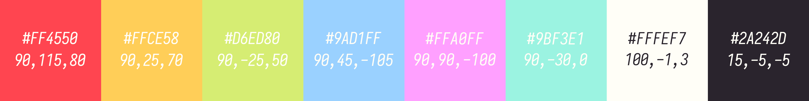
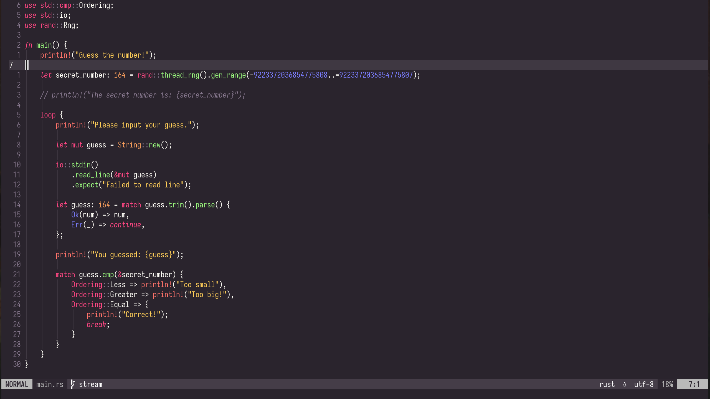

# >> KRXT :: Autumnull
~ A dark flat theme for Neovim ~

## Main palette

<i>The last values are CIELAB, NOT RGB</i>

## Description
Autumnull is yet another dark palette and colorscheme, to be used with Neovim.  
The theme has been created using L\*a\*b\* values, with help of [Adobe Color](https://color.adobe.com/), and [CIELab.io](https://cielab.io/).  
Generating a theme for Neovim in Lua has been done using [colorgen-nvim](https://github.com/LunarVim/colorgen-nvim), which I can heavily recommend.  
A TOML file is provided with color definitions, for use with colorgen-nvim.

### Notice
For now this mostly takes defaults defined in colorgen-nvim's user_template.toml ;w; As I work more on this theme, these will be replaced.  
This theme will change a bit in the future, particularly colors. Background and foreground will not change.

## Plugin support?
When I have more time to work on this :3, soon.

## Preview

